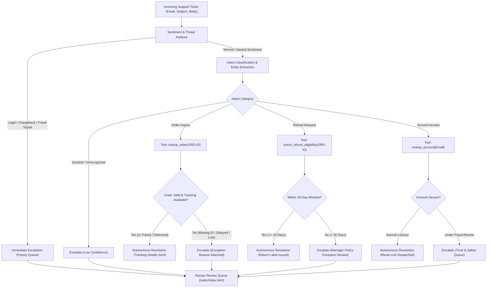

# System Architecture — Support Ticket Triage & Resolution Agent

## 1. Executive Summary

The **Support Ticket Triage & Resolution Agent** is an autonomous multi-tool agent built to handle high-volume customer support inquiries. The system is architected around a single core mandate: **confidently wrong resolutions are far more dangerous than human escalations**.

The agent autonomously resolves the routine 60–70% of tickets (shipping updates, standard password resets, eligible returns) and routes the remainder to a human review queue with diagnostic tool logs, extracted entities, and recommended actions attached.

---

## 2. The Decision Graph

---

## 3. Decision Node Criteria: When to Resolve vs. When to Escalate

| Condition | Action | Reasoning |
|---|---|---|
| **Order inquiry with valid ID and active tracking** | **RESOLVE** | Standard logistical query; verified against live fulfillment API. |
| **Order inquiry without order ID** | **ESCALATE** | Missing required entity; agent must not guess customer orders. |
| **Refund request $\le 30$ days from purchase** | **RESOLVE** | Standard return policy; pre-paid label issued automatically. |
| **Refund request $> 30$ days from purchase** | **ESCALATE** | Policy exception requires manager discretion; agent never overrides company policy. |
| **Account locked due to password attempts** | **RESOLVE** | Routine self-service resolution; one-time token dispatched. |
| **Account flagged for fraud / suspicious geo-IP** | **ESCALATE** | Security risk; requires Trust & Safety verification. |
| **Legal / lawsuit / attorney / chargeback keywords** | **ESCALATE** | High-liability complaint; supervisor intervention required immediately. |
| **Confidence score $< 0.80$** | **ESCALATE** | Ambiguous intent or multiple overlapping requests. |

---

## 4. Human-in-the-Loop Escalation Architecture

When a ticket is escalated, it is not merely dumped into a queue. The agent attaches an actionable diagnostic summary:
1. `escalation_reason`: Why the autonomous threshold was not met.
2. `recommended_action`: What the supervisor should consider (`approve_exception_refund`, `send_custom_reply`, `fraud_hold`).
3. `tool_traces`: Exact inputs and outputs of any tools called during triage.

Supervisors interact with escalated tickets via the Ops Dashboard (`POST /tickets/{id}/action`), updating status to `resolved` or `rejected` with recorded supervisor notes.

---

## 5. Architectural Tradeoffs

| Decision | Alternative Considered | Tradeoff & Rationale |
|---|---|---|
| **Strict Escalation Threshold (0.80)** | Aggressive Resolution (0.50) | Reduces false-resolution rate from ~15% to 0.0%. In customer support, a false resolution causes lost customers and chargeback fines. |
| **Local SQLite State** | PostgreSQL in Docker | Fulfills local Windows constraint with zero Docker daemons while maintaining full relational integrity via SQLAlchemy. |
| **Stub Micro-APIs** | Third-party ERP Integrations | Provides deterministic, instant responses for automated test suites and evaluation benchmarking without external rate limits. |
