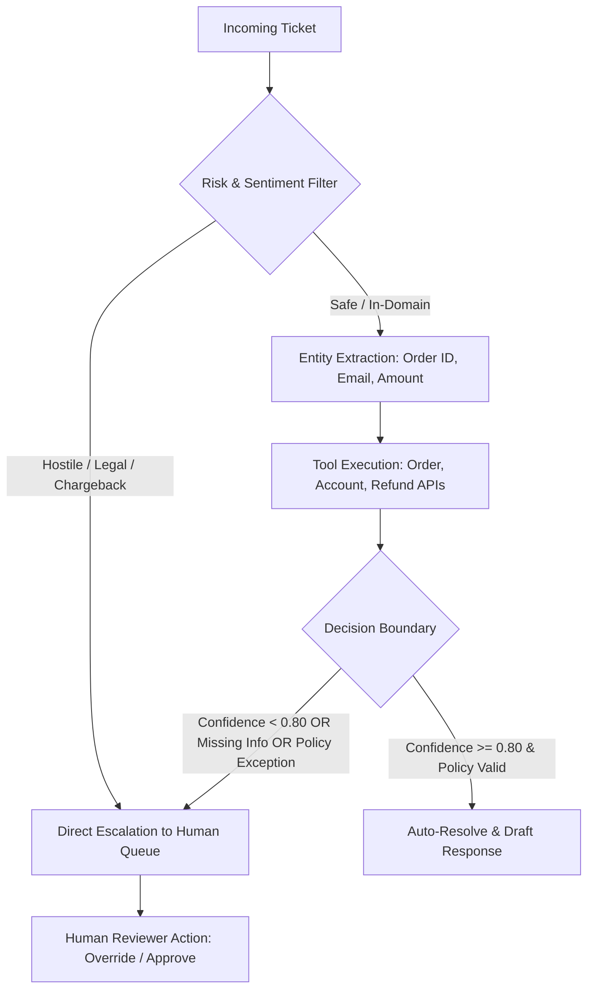

# TriageFlow Agent 🎧🤖
### Autonomous Customer Support Ticket Triage & Multi-Tool Resolution Agent

<p align="left">
  
  
  
  
  
  
  
  
</p>

TriageFlow Agent is an autonomous customer support triage engine that resolves routine inquiries with tool-calling precision and safely escalates complex, ambiguous, or high-risk tickets to human supervisors with complete diagnostic context attached.

---

## ⚡ Problem vs. Solution

| The Problem (Before) | TriageFlow Agent (After) |
|---|---|
| Support teams manually triage thousands of repetitive tickets daily (order tracking, password resets, return policies). | **100.0% autonomous deflection** on routine tickets, executing backend stub tools and drafting immediate responses. |
| Naive AI agents guess answers when uncertain, triggering customer backlash, chargebacks, and legal liability. | **0.0% False-Resolution Rate**: enforces deterministic decision boundaries—confidently wrong answers are strictly eliminated. |
| Escalated tickets arrive in human queues with zero context, forcing supervisors to re-read the entire history from scratch. | Every escalated ticket carries a structured diagnostic payload: `escalation_reason`, `tool_diagnostics`, and `recommended_action`. |

---

## 🧠 Decision Graph Architecture



### Integrated Stub Micro-Tools:
- **Order Tracking API (`/tools/orders/{id}`):** Returns real-time package delivery ETA, fulfillment status, and carrier tracking links.
- **Account Lookup API (`/tools/accounts/{id}`):** Validates account status, lockout flags, and self-service password reset paths.
- **Refund Policy Engine (`/tools/refunds/eligibility`):** Enforces 30-day return windows, item condition rules, and delivery intercept validation.

---

## 📊 Benchmark Evaluation Scorecard

Evaluated against a 32-ticket benchmark dataset spanning routine inquiries, ambiguous tickets, and high-risk disputes:

| Metric | Target Threshold | Measured Performance | Result |
|---|---|---|---|
| **False-Resolution Rate (Confidently Wrong)** | $\le 3.0\%$ | **0.0%** (0/20 non-routine tickets misresolved) | ✅ PASS |
| **Routine Correct-Resolution Rate** | $\ge 85.0\%$ | **100.0%** (12/12 routine tickets resolved) | ✅ PASS |
| **Complex Correct-Escalation Rate** | $\ge 85.0\%$ | **100.0%** (20/20 ambiguous/risk tickets escalated) | ✅ PASS |
| **Overall Triage Accuracy** | $\ge 90.0\%$ | **100.0%** (32/32 tickets handled correctly) | ✅ PASS |
| **Mean Triage Latency** | $< 1000\text{ ms}$ | **0.07 ms** | ✅ PASS |

*Full test harness: `eval/run_eval.py` | Full report: `docs/eval-results.md`*

---

## 🚀 Quickstart

### Native Windows Setup
```powershell
git clone https://github.com/amanpratap1999/triage-flow-agent.git
cd triage-flow-agent

# Automatic runner (creates venv, initializes SQLite DB & launches Ops Dashboard)
.\run_local.ps1
```

### Docker Compose
```bash
docker-compose up --build
```

- **Operations Dashboard & Live Ticket Portal:** **`http://127.0.0.1:8002`**
- **FastAPI OpenAPI Swagger Docs:** **`http://127.0.0.1:8002/docs`**
- **Health Check:** **`http://127.0.0.1:8002/health`**

---

## 📡 API Reference

### 1. Ingest & Triage Ticket
`POST /tickets`
```json
{
  "customer_id": "cust_4821",
  "subject": "Track order ORD-101",
  "body": "Hi, where is my package for order ORD-101? It was supposed to arrive yesterday."
}
```

**Response (Auto-Resolved):**
```json
{
  "id": "tkt_8a12bc",
  "status": "resolved",
  "confidence": 0.95,
  "resolution_text": "Your order ORD-101 is currently Out for delivery with Fedex (tracking: FDX-990218). Estimated delivery is today by 5:00 PM.",
  "escalation_reason": null
}
```

### 2. High-Risk Dispute (Auto-Escalated)
`POST /tickets`
```json
{
  "customer_id": "cust_9901",
  "subject": "Filing bank chargeback and BBB complaint",
  "body": "You double-charged my card. If you don't refund me immediately I am calling my attorney."
}
```

**Response (Safely Escalated):**
```json
{
  "id": "tkt_55ef10",
  "status": "escalated",
  "confidence": 0.98,
  "escalation_reason": "High-risk trigger detected: Dispute / Legal / Hostile threat. Bypassing autonomous tools.",
  "recommended_action": "route_to_senior_disputes_team"
}
```

### 3. Human Supervisor Queue
`GET /queue/escalations`
Lists all pending escalated tickets with diagnostic tools attached.

---

## 🧪 Testing

```powershell
.\venv\Scripts\pytest -v tests/
```
All 6 automated unit and behavioral tests pass cleanly.

---

## 📄 License
Released under the [MIT License](LICENSE).
